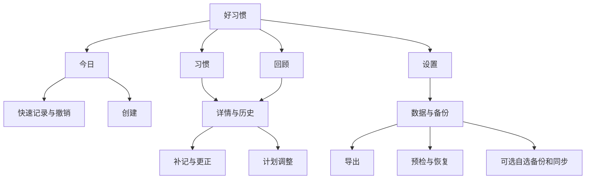

# 交互设计

> 2026-10-02；低保真规格，非实际截图、可点击原型或已完成用户测试。

## 导航和页面

保留“今日、习惯、回顾、设置”四个入口。“设置”取代带账户暗示的“我的”；数据与备份在首屏可见，服务器选择只在相关流程出现。



| 页面 | 内容／主要动作 | 必备状态 |
| --- | --- | --- |
| 首次启动 | 无需账户；创建／恢复 | 空库、旧库迁移、迁移失败 |
| 今日 | 日计划＋周期计划；完成／加量 | 无计划、部分／全部完成、保存失败 |
| 习惯 | 分类、顺序、活跃／暂停／归档 | 空筛选、回收站 |
| 创建编辑 | 名称、类型、目标、频率、提醒 | 校验、键盘、权限拒绝、保存中、存储失败 |
| 详情 | 计划版本、日历、备注、记录明细 | 额外记录、补记、归档、休息 |
| 回顾 | 日完成率与周期达标率分开 | 零分母、进行中、历史不确定标记 |
| 设置 | 数据、提醒、外观、许可 | 无账户仍完整可用 |
| 数据与备份 | 本地状态、备份和同步各自状态 | 未配置、失败、过期、权限失效、冲突 |

## 布局草图

```text
今日 · 10 月 2 日                         ＋
今日计划                      2 / 4 已完成
学习
  阅读     15 / 20 分钟       [＋5] [⋯]
  整理书桌                    [○ 完成]
健康
  喝水      4 / 8 杯          [＋1] [⋯]

本周可安排
  运动      本周 2 / 3 天      [记录]
  本周已达标 ▾

今日        习惯        回顾        设置
```

打卡完成避免卡片瞬间移走导致误点下一项；已完成可折叠。核心输入不能只藏在长按里。数值快捷按钮只执行写明的增量。

```text
数据与备份
本机数据：已保存
未连接同步服务，也可正常使用和升级。

备份：最近成功 今天 09:12
目标：文档 / 好习惯
[立即备份] [从备份恢复]
导出可读数据（JSON / CSV）              >
自动备份（B）                           >
同步服务（C）                           >
回收站                                 >
```

A 不展示尚未实现的 B/C 功能入口；设计原型若展示必须标注规划。内部事务和迁移保护自动运行，不要求用户在这里启用“备份”才能安全保存。“本机已保存”“最近备份”“同步完成”分别表示不同事实。

```text
恢复预览
创建于：2026-10-01 21:00
12 个习惯 · 382 条记录 · 47 条备注
校验通过 · 日期 2026-07-01 至 2026-10-01

将替换本机活动数据。
先保存当前数据的恢复前保护快照。
设备授权、存储密码和系统权限不会导入。

[取消]                      [保护当前并恢复]
```

## 核心流程

1. 首次开始：空今日页，主要按钮创建，次要恢复。模板可选，不能创建历史。首次记录后出现一次可关闭的外部备份建议；不在启动时同时索取多个权限。
2. 创建：名称即可保存默认完成型每日习惯；选择类型才显示目标。选提醒才申请权限，拒绝仍保存习惯，提示“提醒未获权限”。
3. 编辑：外观立即生效，计划展示“从下周一由 3 天改为 2 天，旧周不变”。未保存返回可保留或放弃。保存失败保留输入并可重试。
4. 记录：完成型一次点击；数值快捷加量或面板输入总量。持久化成功后确认；允许加载态但不得假成功。5 秒快捷撤销之外，详情仍可长期更正。
5. 补记：日历点日期，面板写“10 月 1 日记录”，显示实际录入时间。未来日期禁用；非计划日说明额外记录不影响达标。
6. 暂停归档：说明生效日期；恢复默认今天启用。永久删除说明范围并二次确认，不能复用含糊“确定”。
7. 备份：选择可恢复格式／可读导出，默认推荐加密文件，系统选位置，完整写入校验后报成功。明文导出清楚提示可被持有人阅读。
8. 恢复：选文件→限额与结构校验→解密→预览→保护原数据→事务替换→结果检查。取消、错密码、截断、空间不足不触碰原库；A 不自动合并两份备份。
9. WebDAV：地址、用户名、应用密码、目录；测试写入读回删除成功后启用。密码脱敏。说明后台时间由系统安排，打开应用会补做。
10. 同步：自建与官方并列；连接已有空间先预览，空端不得覆盖非空端。断开默认保留本地及未上传修改。
11. 冲突：显示设备与两份内容，可保留本机、另一份或手动合并；计数条目可审查是否重复；不按时钟直接丢一份。
12. 本地异常：存储不足提示“本次尚未保存，释放空间后重试”；迁移失败进入只读／恢复页面，保留旧数据。不能推荐卸载、清空数据或启用云同步来绕过错误。

## 视觉与可访问性

| 项目 | 规格起点 |
| --- | --- |
| 基础 | 暖白、柔和绿色、系统字体、克制卡片 |
| 色值 | 浅背景 #F7F5EF，深背景 #111411，主色种子 #5F8068；最终配对测试对比度 |
| 字体 | 正文 16sp、次级 14sp、标题 24sp，尊重系统缩放 |
| 间距 | 4/8/12/16/24/32dp，主边距 16–20dp |
| 触控 | 至少 48×48dp；图标有语义标签 |
| 状态 | 文字＋形状＋颜色，不只靠颜色 |
| 动效 | 150–250ms，支持减少动态，不阻塞操作 |
| 主题 | 跟随系统／浅色／深色；自选色不损害文本可读性 |

TalkBack 示例：“喝水，今天 4 杯，目标 8 杯，增加 1 杯，按钮”。图表提供文本摘要，状态变化不重复朗读整页。200% 字号、小屏、显示缩放、横屏、系统返回均验证。

开发前做 3–5 人原型任务测试：创建周三天、完成撤销、两次数值记录、补记、暂停恢复、文件恢复、区分保存备份同步。记录错误和提示需求，不假设文字规格已经证明易用。
