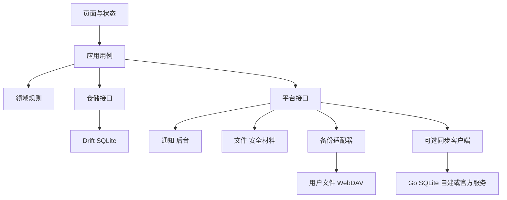

# 技术架构与选型

> 2026-10-02。新方案待实施；新增库先验证再锁定版本，不把“最新版”当可复现环境。MIT 继续使用。

## 1. 技术选择

客户端继续 Flutter/Dart + Material 3，核心数据改为 SQLite/Drift，领域规则和平台能力分离。同步服务首版采用单实例 Go + SQLite，官方早期托管也使用同一实现。PostgreSQL 仅作为容量／高可用需求明确后的演进选项。

| 候选 | 对当前目标的判断 |
| --- | --- |
| Flutter | 共享 UI 和业务，已有经验可利用；系统能力仍需原生验证，推荐保留 |
| React Native | 无已知 TS 团队优势，重写收益不足 |
| Kotlin/KMP | Android 系统整合强，但增加当前重写与未来 iOS UI 取舍 |
| 双端原生 | 双套界面和测试维护，不符合当前投入 |
| PWA | 后台提醒、持久存储和系统集成不适合作为当前主应用 |

## 2. 客户端栈

| 层 | 选择／候选 | 约束 |
| --- | --- | --- |
| SDK | 固定 Flutter stable 与匹配 Dart | 当前 Dart 约束 ^3.12.2；A0 先重现，再锁组合 |
| UI | Material 3 + 自有设计令牌 | 中文优先，未来 l10n；iOS 系统交互单独适配 |
| 状态 | 新 feature 用 Riverpod，旧 ChangeNotifier 过渡 | 不先为了框架做全仓重写 |
| 路由 | Navigator；深链复杂后再选 go_router | 避免无收益依赖 |
| 数据 | Drift + SQLite，WAL／事务／迁移 | 配置与可靠性按本地数据完整性规格验证 |
| 偏好 | SharedPreferences 仅非关键可重建 UI 偏好 | 核心事实不再整体 JSON 保存 |
| 时间 | timezone + IANA、Clock 抽象 | 日历运算、稳定所属日期 |
| 通知 | flutter_local_notifications | 复用插件，重建调度和动作载荷 |
| 文件 | 系统文件选择器＋SAF／分享适配 | 不索取全盘存储权限 |
| 凭据 | Keystore／Keychain，候选 flutter_secure_storage | 升级、设备锁和恢复生命周期必测 |
| 加密 | 维护中的 libsodium 绑定 | Argon2id + XChaCha20-Poly1305；验证 FFI、16 KB、iOS |
| HTTP | 单一客户端如 Dio、WebDAV 适配 | 超时、取消、退避、TLS 验证、脱敏 |
| 后台 | Android WorkManager；候选 workmanager 插件 | 允许延迟的备份与同步，前台补做 |
| 测试 | flutter_test、integration_test、真实 SQLite 夹具 | 领域／存储／系统测试分开 |

不依赖 Firebase、Google 登录或专有分析 SDK 才能使用核心功能。新增库须检查维护状态、第三方许可证、原生依赖和离线行为。F-Droid 兼容是方向，审核前不宣称已满足分发要求。

本地库应用级加密与备份／E2EE 区别见本地数据完整性；不得为加密增强牺牲升级可读性。SQLCipher 候选须先验证再决定是否纳入 A。

## 3. 依赖方向

建议渐进形成 lib/app、core、features/habits、records、review、reminders、backup、sync、storage；每个 feature 分 domain/application/data/presentation。领域不依赖 Widget、HTTP 或 Android。服务端到 C 再创建 server 目录。

用例统一写事务，包含事实与本地 change log；事务提交后 UI 确认，提醒是可重试副作用。A 预留稳定 ID、版本和删除语义，不提前实现复杂分布式框架。统计为可重建投影，不成为唯一事实。

## 4. Android 与未来 iOS

| 能力 | Android | iOS 未来 | 共享 |
| --- | --- | --- | --- |
| 文件 | SAF、持久 URI 授权 | 文档选择器和文件协调 | 格式、校验、恢复 |
| 提醒 | 本地通知、权限、重启和冷启动 | UNUserNotificationCenter、平台限额 | 应提醒实例计算 |
| 后台 | WorkManager＋前台补做 | BGTaskScheduler＋前台补做 | 快照、重试、合并 |
| 安全材料 | Keystore | Keychain | 密钥协议 |
| 导航 | 返回／预测返回、TalkBack | 手势返回、安全区、VoiceOver | 页面任务、语义 |
| Widget／计时 | D 决定 | 独立后续实现 | 记录用例 |

iOS 当前只做插件能力审阅和数据／领域隔离，不宣称工程目录存在就已经支持。macOS、Xcode、真机、签名和发布留到 iOS 阶段。

Android 最低版本先验证 API 24（历史文档基线），实际 Gradle 跟随 Flutter 默认，须用合并清单确认。若插件迫使提高最低版本，先报告旧设备影响；target/compile SDK 按发布时验证组合及渠道政策锁定。

## 5. 提醒

从有效计划和完成状态生成有限窗口实例，设备本地唯一通知 ID，不靠取模哈希。实例携带 habitId、所属日期、计划版本、actionId；动作幂等，跨午夜不默认记到点击当天。

创建、编辑、完成、暂停、恢复、时区变化、启动、升级与重启均可触发重算。冷启动动作先排队，数据库可用后处理。过期计划重核，异常状态可见。

默认系统允许的非精确提醒，不预申请精确闹钟权限。权限拒绝、渠道关闭、省电与强制停止分别诊断；不能承诺强制停止后仍送达。调度窗口大小用大量习惯验证，必要时显示未来覆盖期限，前台自动补齐。

## 6. 小型自部署服务

Go 标准 net/http（按需轻量路由）、版本化 SQL migration、OpenAPI、SQLite 单写协调与 WAL。首版一个应用进程、一个持久化数据目录，支持原生二进制或单容器；TLS 由已有反向代理或可选 Caddy 提供。无必须的独立数据库服务器、Redis、消息队列或 Kubernetes。

服务端 SQLite 与手机 SQLite 是相互独立的库，通过版本化同步 API 通信，不共享数据库文件。服务数据库放本地可靠磁盘；禁止共享 NAS 网络文件系统上多实例同时写同一 SQLite 文件。NAS 运行容器可使用其本机卷，但须验证文件锁和 fsync 行为。

官方初期采用相同单实例部署，备份／恢复和版本升级一致。并发写延迟、容量或高可用要求超出验证范围时，再实施 PostgreSQL 适配和显式迁移；不让客户端提前依赖某种数据库。

服务器只处理账户／设备授权、隔离空间、加密对象、提交顺序游标、配额和状态。无附件首版，密文可放 SQLite；大文件对象存储以后按需求增加。客户端解密和计算业务。

支持无 SMTP 的 CLI 初始化／邀请，使用成熟认证与密码哈希库、短期令牌和轮换刷新令牌，撤销设备有效。账户密码找回不能绕过 E2EE。不同用户按服务端授权隔离，不能信任客户端自报 userId。

目标验证基线：1 vCPU、1 GiB RAM、个人／小组不超过 20 用户、每用户 3 台设备，10 万对象样本；ARM64 与 x86_64 两种构建。属于待测目标，不是性能承诺。测试空闲内存、同步突发、磁盘增长和并发恢复后再公布支持规模。

部署文档提供配置模板、初始化、HTTPS、数据卷、非 root 运行、版本升级、健康检查、空间告警和恢复演练。密钥／实际凭据不入库。日志不包含内容、授权头或恢复材料。

数据库备份使用 SQLite backup API 或停写一致快照，不仅复制主文件。个人服务建议初始 RPO≤24h、RTO≤4h，以异机演练确认；用户独立备份仍有独立作用。官方地域、保存期、SLA 和收费在 C2 前确定。

## 7. 工程与验证

A0 固定 Flutter/JDK/AGP 和锁文件，Linux CI 执行静态分析、领域/widget/真实迁移测试并产生 debug APK。正式 release 只走受保护签名，缺签名即失败；不自动修改源码版本号。公开提供源码 tag、构建说明、校验和、证书指纹、第三方许可和恢复文档。

必须技术验证：Drift 中断与 I/O 失败、SAF 授权撤销和读回、密码学内存耗时与原生 16 KB 兼容、通知冷启动日期、密钥普通升级可用；B 验证两种 WebDAV；C 验证 CAS、游标提交顺序、备份恢复、密钥轮换与小机器负载。未执行的测试不标完成。

参考入口：
- [Flutter 平台](https://docs.flutter.dev/reference/supported-platforms)
- [Drift 事务](https://drift.simonbinder.eu/dart_api/transactions/)与[迁移](https://drift.simonbinder.eu/migrations/)
- [SQLite WAL](https://www.sqlite.org/wal.html)与[在线备份](https://www.sqlite.org/backup.html)
- [Android 文件访问](https://developer.android.com/training/data-storage/shared/documents-files)、[后台任务](https://developer.android.com/develop/background-work/background-tasks/persistent)、[16 KB](https://developer.android.com/guide/practices/page-sizes)
- [libsodium 密码派生](https://doc.libsodium.org/password_hashing/default_phf)与[AEAD](https://doc.libsodium.org/secret-key_cryptography/aead)
