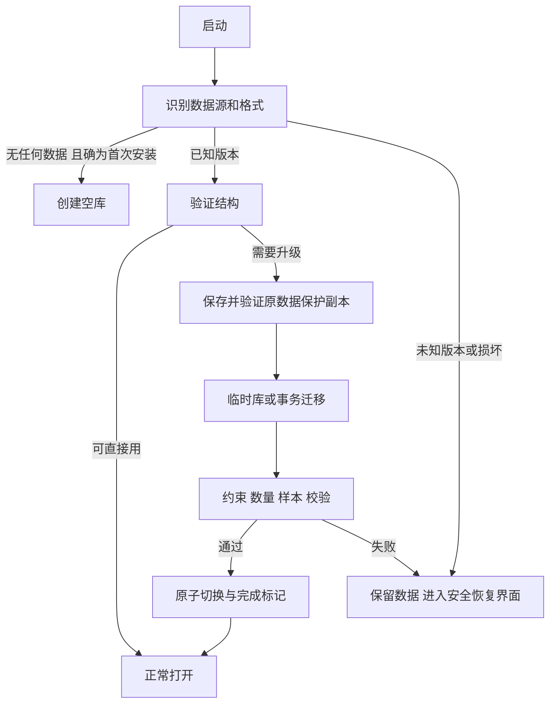

# 本地数据完整性与升级可靠性

> 2026-10-02；用户明确要求：不接入同步和备份时，正常使用和更新也要保持数据完整。本文件是 A 阶段发布阻塞规格；已验证与未验证场景按[实施进度](实施进度.md)和原始证据逐项区分。

## 1. 保证范围

**只要用户没有明确执行删除／替换，应用不能因正常操作、兼容覆盖升级、进程中断或关闭云功能而丢失已确认保存的数据。** 这一保证不依赖用户手工导出、配置网盘、登录账户或定期打开同步。

已确认保存指本地事务已成功提交后，应用向用户展示保存成功。尚未提交的输入遇到失败要保留或清楚告知未保存，不能把界面变色当成落盘证据。

范围包括习惯、顺序、分类、记录、备注、计划历史、暂停归档区间、回收站、必要设置及数据解读所需元信息。外观设置故障不得牵连核心记录。

“兼容覆盖升级”是包身份、签名和受支持迁移路径都正确的覆盖安装。卸载、系统清除应用数据、用户明确永久删除／替换、设备丢失或存储硬件不可读不属于普通更新；UI 和迁移说明必须准确区分。独立备份用于这些超出单机存储能力的恢复场景，不能反过来替代本规格。

## 2. 三层职责

| 层 | 默认状态 | 职责 |
| --- | --- | --- |
| 本地完整性 | 始终开启，不需要设置 | 事务、持久化确认、迁移保护、启动恢复、防静默重置 |
| 用户备份 | 用户选择目标、加密及计划 | 独立时间点副本，支持换机与外部故障恢复 |
| 同步 | 用户主动连接 | 多设备合并，包括删除；不代替历史副本 |

内部迁移保护快照属于应用实现细节，不在产品流程里要求用户“先启用备份”。它与原库在同设备，不能宣传为防设备丢失的独立备份。

## 3. 强制不变量

| ID | 规则 |
| --- | --- |
| L01 | 业务写入、版本号和本地变更日志同事务提交；UI 确认在提交之后 |
| L02 | 不因 JSON 异常、数据库打开失败、未知 schema 或密钥暂不可用而自动删库、换空库或播种示例 |
| L03 | 数据目录、数据库名、包名、持久化键和本地密钥标识保持稳定；变更须显式迁移 |
| L04 | 更改频率、目标和归档不能重解释已结束历史；事实记录与规则版本分离 |
| L05 | 单次写入错误不会毒化后续队列；失败可见，可恢复重试；重传不重复写入 |
| L06 | 迁移开始前保留可验证原数据；新库完整验证前不切换，不修改完成标记 |
| L07 | 中断重启后只能看到完整旧版本或完整新版本，不出现半迁移 |
| L08 | 离线、未登录、令牌过期、断开服务器、备份失败均不得删除／锁住本地数据 |
| L09 | 内部清理只清可重建缓存；不能把数据库、WAL、原始迁移源或唯一有效保护副本当缓存删 |
| L10 | 权限／提醒／网络副作用失败不回滚已保存的业务数据，也不重复用户记录 |
| L11 | 不要求卸载、清除应用数据或打开云同步来完成正常升级 |
| L12 | 仅用户明确删除、确认替换或到期的已告知回收站清理可移除对应业务内容；无隐式清库路径 |

## 4. 存储与写入

使用 SQLite/Drift，外键和约束开启。A0 验证 WAL + synchronous=FULL 或等价可靠配置，检查每条连接／isolate 的实际设置，不能用默认参数推定已满足。应用成功提示与 SQLite 提交边界一致；日常备份不能只复制主文件漏掉 WAL。

写事务统一入口、有限 busy 重试、同动作 id 幂等。快速连点、后台动作与前台编辑经同一用例处理。发生磁盘满、I/O 错误、busy 超时或进程切换，保留已提交事务；失败项保留输入和可重试状态，禁止无限重试耗电。

应用进入后台不把数据库移入缓存，也不以整份内存 JSON 最后覆盖的方式覆盖更近期操作。应用正常启动不修改已存在数据的创建时间、ID、历史日期或完成时间。

自动健康检查应轻量并按需执行；发现损坏停止危险写入，保留文件并进入恢复界面。物理介质损坏后从较旧保护快照恢复可能存在时间差，必须显示快照时间并保留原证据，不能声称凭快照恢复了所有最近提交。

## 5. 启动与升级状态机

缺少主键不等于首次安装：还要检测旧备份键、旧数据库、迁移记录和新库。已迁移不再次导入旧 JSON。版本不支持时可提供原始数据导出与升级提示，不作破坏性降级。

迁移失败后的应用应可打开只读／恢复界面，用户可查看问题、释放空间、导出源数据和重试。新版安装成功但业务迁移未完成时，不以“升级完成”假装可正常写入。

## 6. 本地密钥与加密边界

备份文件加密、网络 TLS、同步端到端加密各自有明确作用。A 默认本地 SQLite 依赖系统沙箱和设备存储保护，不冒称整个数据库已应用级加密；额外 SQLCipher 等本地加密作为 A0 的增强验证项，只有通过密钥持久性／原生兼容／迁移恢复测试才纳入实现承诺。

无论是否使用数据库加密，Keystore/Keychain 中的凭据不能随普通应用升级、主题修改、退出同步账户或账户密码重置而被清掉。若启用本地库加密，其密钥独立于服务器登录令牌；不能以“登录过期”让本地记录无法读取。

更改屏幕锁、生物识别、系统恢复等导致密钥状态变化时，给明确可恢复路径；不得自动生成新密钥并创建空库覆盖原库。密钥轮换应可中断续做，旧密钥在新数据验证完成前保留受控可用状态。

## 7. 必须在关闭云能力时执行的验收

测试基线：飞行模式、从未登录、未设置用户备份目标，预置三类记录、备注、计划历史和归档。结果按规范化业务数据摘要及逐字段比较，不能只比条目数量。

| 用例 | 操作 | 通过条件 |
| --- | --- | --- |
| L-T01 | 正常创建、累计、更正、排序、改外观，多次重启 | 全部已确认操作保留，事实字段一致 |
| L-T02 | 事务前／中／提交后分别强制终止进程 | 未提交完整回滚；已确认提交完整存在 |
| L-T03 | 保存后模拟重启；真实断电在可控设备验证 | 数据符合持久性边界，无部分记录 |
| L-T04 | 快速连点＋前后台通知同时写同习惯 | 无丢更新，同动作无重复 |
| L-T05 | 空间不足、一次写失败，再释放空间保存 | 明示失败，旧内容不变，后续写入恢复 |
| L-T06 | 从每个已支持旧 schema 覆盖升级 | 不要求用户备份；事实完整、迁移报告准确 |
| L-T07 | 迁移各阶段注入进程中断／空间不足 | 旧／新至少一份完整，重试幂等 |
| L-T08 | 连续两次升级，同一版本重复打开 | 不重新播种，不重复迁移 |
| L-T09 | 损坏主源、缺主键有保护副本、双坏、未知新版 | 保留原证据并提供恢复，不自动清库 |
| L-T10 | 切时区、跨月／闰日、改目标、暂停归档 | 历史事实不变，统计按对应计划版本 |
| L-T11 | 连接后退出、令牌过期、服务故障，再回本地 | 数据和本地密钥仍可用，未上传变更不丢 |
| L-T12 | 系统清缓存、普通权限撤回、提醒初始化失败 | 数据不受损；副作用错误单独报告 |
| L-T13 | 加密密钥轮换／暂不可用（若启用本地库加密） | 不把无法解密当空库；升级仍可解密 |
| L-T14 | 旧签名兼容包覆盖安装、应用升级后首次启动 | 数据和应用身份连续；不能用重装代替覆盖验收 |

任何已确认写入在上述正常使用／兼容升级场景中丢失，均为 P0，不得以“用户应该做备份”降级处理。物理破坏、主动清数据等超出范围的场景单列为恢复能力测试，不混入正常使用保证。
